  

  
  
  
  
  
  
  

---

# ✈️ Awesome Crew Training Management

A curated directory and comprehensive guide to the **Top Aviation Crew Training Management Systems**, **Electronic Training Records (ETR)**, **Competency-Based Training & Assessment (CBTA / EBT)** grading platforms, **Pilot Logbooks**, and **Aviation Learning Management Systems (LMS)**.

Designed for flight operations directors, airline training managers, Approved Training Organisations (ATOs), flight academies, and aviation software engineers seeking open, adaptable, and compliant pilot and crew training infrastructure.

> **Regulatory Compliance Keywords**: EASA Part-FCL • EASA Part-ORA • FAA Part 61 / 141 / 121 / 135 • ICAO Doc 9868 (CBTA) • Evidence-Based Training (EBT) • Flight Time Limitations (FTL) • IOSA Standards

---

## 📑 Table of Contents

- [🏢 SaaS & Hosted Commercial Platforms](#-saashosted-commercial-platforms)
- [💻 Open-Source Aviation Projects](#-open-source-aviation-projects)
- [🎯 Key Capabilities & Architectural Patterns](#-key-capabilities--architectural-patterns)
- [🤝 How to Contribute](#-how-to-contribute)
- [📈 Star History](#-star-history)
- [⚖️ Disclaimer](#️-disclaimer)

---

## 🏢 SaaS / Hosted Commercial Platforms

Below is a curated comparison of leading commercial SaaS platforms for aviation crew training management, Electronic Training Records (ETR), and ATO operations.

> **Sorted by Company Size / Scale (Descending)**

| Platform / Tool | Focus / Description | Company Size (Revenue / Valuation) | Starting Pricing | Free Tier / Trial Limits |
| :--- | :--- | :--- | :--- | :--- |
| **[CrewLounge AERO](https://www.crewlounge.aero/)** | 📱 Crew suite for pilot logbooks, duty tracking, roster integration, and qualification monitoring. | Parent: Thales Group (Euronext: HO) — **~$20B+ Revenue / ~$35B Market Cap** (Operated via AvioBook; 190+ employees) | Free forever tier; paid subscriptions start at €13.49 / year (CONNECT) or €39.99 / year (PILOTLOG Enterprise) | **Free Forever** (Student Edition: up to 100 flights, 60 official logbook formats, 50 reports) |
| **[AeroDocs](https://www.aerodocs.com/)** | 📄 Aviation document management and compliance tracking system for flight operations and crew compliance manuals. | Parent: Viasat, Inc. (NASDAQ: VSAT) — **~$4.3B Revenue / ~$3.5B+ Enterprise Value** (Acquired for $21.6M) | Enterprise starting tier from ~$18,000 / year (base airline document & compliance distribution) | 30-day enterprise evaluation pilot (includes sample fleet manual library & 5 test crew licenses) |
| **[Comply365](https://www.comply365.com/)** | 📋 Aviation compliance & electronic training records (ETR) suite (TrainingManager365 / former MINT) for airlines and defense. | Backed by Insight Partners & Liberty Hall Capital — **~$300M–$500M Est. Group Valuation / ~$50M–$80M ARR** (Combined group includes Vistair, Qualtero & MINT; 300+ employees) | Enterprise starting tier from ~$15,000 / year (base airline / ATO qualification module) | 30-day guided POC trial for airline training departments (limited to 10 test crew accounts) |
| **[Takeflite](https://www.takeflite.com/)** | 🛫 Flight operations and training management software for regional carriers and ATOs (scheduling, crew rosters, and compliance). | Parent: Portside Inc. — **$130M+ Total Funding / ~$28.4M+ Group ARR** (Takeflite acquired in 2024; standalone ~$7M ARR) | Starts at $500.00 / month (base module subscription; e.g. Distribution Plus / base ops module) | 14-day guided proof-of-concept trial (full access to core operational modules following fit call) |
| **[LMS365 / Learn365](https://www.lms365.com/)** | 🎓 Microsoft 365 & SharePoint integrated LMS adapted for aviation ground school, compliance tracking, and crew recurrent training. | Zensai (formerly Elearningforce) — **~$100M+ Est. Valuation / $20M+ ARR** ($20M Series A led by Blue Cloud Ventures; 100+ employees) | $4.50 / user / month (billed annually, standard tier) | 30-day free trial on Microsoft AppSource (full course catalog & admin access; excludes native mobile/Teams add-on) |
| **[Qualtero](https://www.qualtero.com/)** | 🎯 Aviation training and qualification management platform (Fox TMS, CBTA/EBT grading, FTL, and regulatory compliance). | Comply365 Subsidiary — **~$15M–$25M Est. Standalone Revenue / ~$40M–$60M M&A Valuation** (Acquired Sept 2024 by Comply365; 100+ employees) | Starts at ~$1,000 / month (~$12,000/year base deployment for ATOs/operators) | 30-day guided evaluation sandbox (limited to 10 instructor test accounts upon request) |
| **[Leon Training](https://www.leon.aero/)** | 📊 Flight operations & crew training management platform for business aviation and operators (currency tracking and FTL). | Leon Software Sp. z o.o. — **~$10M–$15M Est. Annual Revenue** (Bootstrapped/Private; 50–100+ employees globally) | €99.00 / active aircraft / month (BASIC tier) | 30-day free trial (1 full month with unlimited users, fleet setup, and FTL tracking; no credit card required) |
| **[Hinfact](https://www.hinfact.com/)** | 🧠 Competency-Based Training & Assessment (CBTA) and Evidence-Based Training (EBT) e-grading and analytics platform. | Venture-backed (Innovacom) — **~$15M–$20M Est. Valuation / €4.33M (~$4.7M) Funding Raised** (~40 employees) | Starts at ~€199.00 / month (or €15 / pilot / month for ATO training modules) | 30-day guided evaluation sandbox for ATOs/airlines (with sample CBTA grading syllabus & instructor app access) |
| **[FlightLogger](https://www.flightlogger.net/)** | 🗂️ All-in-one training management platform for flight schools & ATOs (student progress, CBTA syllabi, booking, and records). | Arcadea Group backed — **~$3M–$5M Est. ARR / ~$10M–$15M Est. Valuation** (20–50 employees) | €359.00 / month (starting base subscription for flight training organizations) | 14-day interactive evaluation sandbox (pre-loaded with sample fleet/student syllabi upon onboarding) |
| **[Avsoft](https://www.avsoft.com/)** | ✈️ Aviation training courseware provider offering aircraft systems CBT, general subjects, and portable classroom LMS. | Avsoft International — **~$2M–$5M Est. Annual Revenue** (Bootstrapped; ~15–30 employees) | Starts at $59.00 / course (or flexible monthly installment plans for corporate ATOs) | 30-day free evaluation trial for ATOs and airlines (full courseware and LMS module access) |
| **[Aviatize](https://www.aviatize.com/)** | ☁️ Cloud flight school and ATO management platform with student syllabus tracking, scheduling, and billing. | Aviatize BVBA — **~$1M–$3M Est. Annual Revenue** (Privately held; ~10–20 employees) | $29.00 / aircraft / month (billed annually, includes unlimited users) | 30-day guided free trial (unlimited student/instructor accounts following a 30-minute fit call) |
| **[Aviation eLearning](https://www.aviationelearning.com/)** | 🥽 Aviation e-learning, cockpit procedure trainers, and virtual 360 courseware for pilot and crew training. | Aviation eLearning ApS — **~$1M–$2M Est. Annual Revenue** (Privately held; ~7–15 employees) | €39.00 / course (pay-as-you-train individual modules; e.g., B737NG procedures) | 30-day free evaluation trial for V360E platform / course demo access (up to 5 trainee licenses) |

---

## 💻 Open-Source Aviation Projects

Open-source tools, pilot logbooks, learning management systems, and flight data monitoring libraries that flight schools, ATOs, and airlines can self-host and customize.

> **Sorted by GitHub Stars (Descending)**

- **[Moodle](https://github.com/moodle/moodle)**   
  🎓 The most widely deployed open-source Learning Management System (LMS). Extensively adapted by flight schools, ATOs, and airline training departments for ground school syllabi, SCORM/xAPI courseware delivery, recurrent knowledge exams, and student progress tracking.

- **[Canvas LMS](https://github.com/instructure/canvas-lms)**   
  🏛️ Enterprise-grade open-source LMS featuring modular curricula, automated grading rubrics, competency mastery paths, and robust REST APIs for integrating theoretical flight school training with electronic logbook systems.

- **[Open edX](https://github.com/openedx/edx-platform)**   
  🌐 Scalable, open-source online learning platform capable of hosting massive airline training libraries, video procedural demos, recurrent compliance courses, and structured pilot certification tracks.

- **[pyModeS](https://github.com/junzis/pyModeS)**   
  📡 Open-source Python decoder and analytics toolkit for Mode-S and ADS-B flight telemetry. Widely utilized in Flight Data Monitoring (FDM/FOQA), post-flight simulator debriefing, and Competency-Based Training (CBTA) trajectory evaluation.

- **[Chamilo LMS](https://github.com/chamilo/chamilo-lms)**   
  ⏱️ Lightweight, intuitive open-source LMS tailored for skill-based qualification tracks, time-tracked compliance assessments, and SCORM-compliant aviation training modules.

- **[FlightGear](https://github.com/FlightGear/flightgear)**   
  🛩️ Open-source flight simulator framework frequently used for academic aerospace research, desktop procedural flight training, navigation practice, and real-time flight dynamics logging.

- **[Web-Logbook](https://github.com/vsimakhin/web-logbook)**   
  📖 Self-hosted electronic pilot flight logbook conforming to EASA and FAA logging requirements. Includes license expiry notifications, medical tracking, night-time calculation, and instructor signature capture.

- **[openPilotLog](https://github.com/fiffty-50/openPilotLog)**   
  💻 Modern, cross-platform C++/Qt pilot logbook application supporting multiple regulatory formats (EASA FCL.050, FAA Part 61), currency calculations, and SQLite data portability.

- **[FlyMe](https://github.com/carstenfuchs/flyme)**   
  🛬 Open-source (MIT) web-based logbook and flying club management platform for private pilots, flight instructors, and small training associations.

- **[VATSIM Pilot Training Center](https://github.com/Vatsim-Scandinavia/pilot-training-center)**   
  👨‍✈️ Structured pilot training portal providing syllabus tracking, mentor scheduling, practical exam grading workflows, and trainee qualification certification.

- **[Manage2Soar](https://github.com/pietbarber/Manage2Soar)**   
  🪂 Django-based platform for flight clubs and soaring ATOs, managing member flight hours, student progress tracking, instructor sign-offs, duty rosters, and winch/towplane qualifications.

- **[Airman Record](https://github.com/AirmanTwelve/airman-record)**   
  📝 Web-based pilot training log and currency record tracker for individual aviators and flight instruction environments.

- **[Aviation Compliance Checker](https://github.com/ashishjsharda/aviation-compliance-checker)**   
  🔍 Automated CI/CD tool and GitHub Action for validating aviation logbook data schemas, flight time limits (FTL), and regulatory compliance criteria.

---

## 🎯 Key Capabilities & Architectural Patterns

When building or adopting an aviation crew training management system, key architectural modules include:

1. **Electronic Training Records (ETR)** 📋  
   Digital student/crew dossiers capturing stage checks, instructor endorsements, flight test evaluations, and audit trails conforming to EASA Part-ORA.ATO / FAA Part 141 regulations.

2. **Competency-Based Training & Assessment (CBTA / EBT)** 🎯  
   Objective grading rubrics based on ICAO competencies (e.g., Application of Knowledge, Communication, Aeroplane Flight Path Management, Leadership & Teamwork, Problem Solving & Decision Making, Situational Awareness, Workload Management).

3. **Flight Time Limitations (FTL) & Currency Engines** ⏱️  
   Automated tracking of recent experience (e.g., 3 takeoffs/landings within 90 days), instrument approach currency, flight duty period limits, and rest requirement calculations.

4. **SCORM / xAPI / CMI5 Ground School Integration** 🧩  
   Seamless connection between theoretical learning management systems and flight operations rosters for recurrent ground school completion tracking.

---

## 🤝 How to Contribute

Contributions are warmly welcomed! Help keep this curated directory the most authoritative resource in aviation training:

1. 🍴 Fork the repository.
2. 📝 Add or update an entry in [`README.md`](README.md) following the established format.
3. 🔗 Include official homepage/repository URLs, company size/valuation metrics, pricing details, and star badges for open-source repos.
4. 🚀 Submit a Pull Request with a brief summary of the addition.

---

## 📈 Star History

---

## ⚖️ Disclaimer

- This is an open community-curated repository and does not constitute official regulatory counsel or commercial endorsement.
- Aviation training management systems must strictly comply with applicable national and international aviation authorities (EASA, FAA, ICAO, CAAC, UK CAA, Transport Canada, etc.).
- Always verify that any software deployed for official training records meets your authority's data security, digital signature, and audit trail requirements.

---

  <b>Made with ✈️ for Aviation Training Directors, ATO Administrators, Flight Instructors, and Airline Crew Management Teams.</b>

